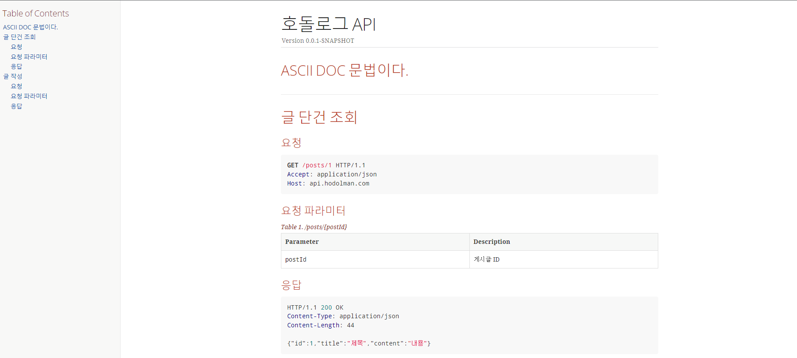
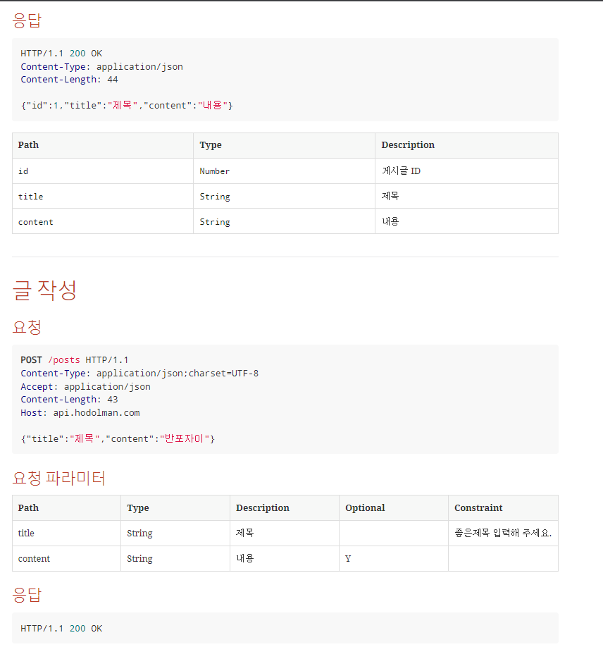

## 인프런 호돌맨의 요절복통 개발쇼 (SpringBoot, Vue.JS, AWS)

### TechStack

+ Java11
+ Spring Boot
+ JPA
+ Vue.js
+ QueryDSL
+ Spring REST DOCS
+ Git
+ IntelliJ

### 리눅스 썻던 명령어 search (reverse-i-search)
+ ctrl + r + 생각나는 단어
+ which java : jav가 어느 경로에 install 되었는지
  - which외에도 whereis, locate가 있음
  - 참고 : https://webdir.tistory.com/158
+ touch : 날짜와 시간을 수정하는 명령어이긴 하지만, 0바이트 파일을 생성하기 위해 자주 사용하기도 함

## EC2에서 어플리케이션 띄우고 인터넷에서 바로 접근 되지 않는 이유

+ 방화벽 때문이다 : 22번 포트는 보안 그룹의 inbound규칙을 모든 ip로 열어놔도 일단은 pem키 통해서 접속하는 것이기 때문에 안전함, 어플리케이션인 포트인 8080포트는 관련 설정이 없으므로 추가 설정이 필요하다.

## 애플리케이션 프로세스 유지하기
+ 터미널을 종료하면 어플리케이션이 같이 종료됨. 
+ 터미널이 종료되더라도 어플리케이션이 유지되게 하려면?
  - nohup java -jar ~~ &
  - nohup이란? : no hang up
  - nohup 뒤에 &기호의 의미
    - & : 백그라운드로 실행한다.
  - > 또는 >> 명령의 의미 : 리다이렉션
  - [참고1](https://devnoong.tistory.com/45)
  - [참고2](https://joonyon.tistory.com/entry/%EC%89%BD%EA%B2%8C-%EC%84%A4%EB%AA%85%ED%95%9C-nohup-%EA%B3%BC-%EB%B0%B1%EA%B7%B8%EB%9D%BC%EC%9A%B4%EB%93%9C-%EB%AA%85%EB%A0%B9%EC%96%B4-%EC%82%AC%EC%9A%A9%EB%B2%95)

+ netstat : 네트워크 상태 확인

## 인증
+ 글 작성시 아무나 api call하면 등록이 됨

## 2가지 방법을 이용해보자
1. Get Parameter : url 리소스에 불필요한 값이 추가되는 문제가 있다.
2. Header로 체크

## Interceptor 사용하기
+ HandlerIntercepter를 구현하는 방식으로
  - preHandle
  - postHandle
  - afterCompletion

+ WebMvcConfigurer에 다가 등록을 해야지 동작함
  - 특정 api에는 인증을 제외하고 싶다면?
    - excludePathPatterns에다가 추가하면 됨
